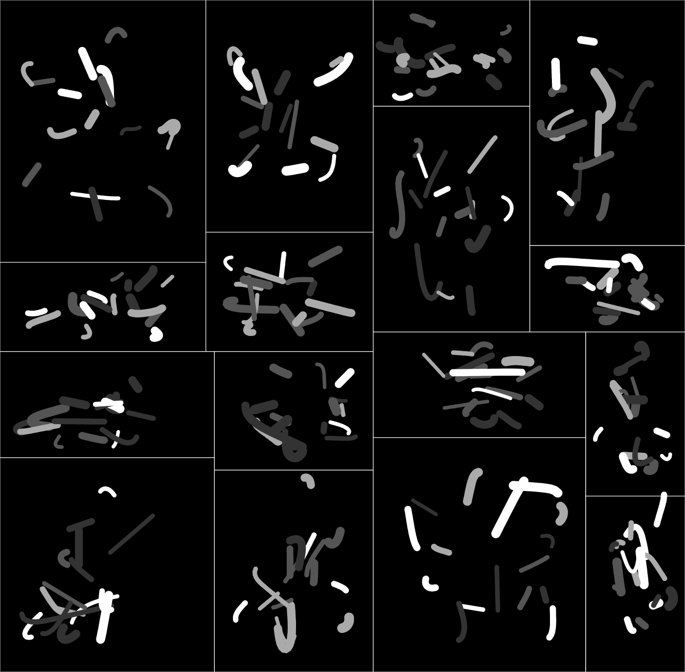

# fx(hash) Functional Core project



## About

This project is a compact TypeScript generative art sketch aimed at the
[fx(hash)](https://fxhash.xyz) NFT platform/marketplace. It uses
[Vite](https://vitejs.dev/) for local development and production bundling.

The codebase has been refactored around a strict Functional Core / Imperative
Shell boundary. The generative system is driven by explicit configuration and
returns a small internal Scene AST, while browser, canvas, fxhash, downloads,
and keyboard handling live outside the core.

**The template is currently using the following version of the fxhash project sdk:** [61ac228c](https://github.com/fxhash/fxhash-package/commit/61ac228ce103fcea2e28c365f0facd38f0b8479f)

### Architecture

The project is split into three dependency zones:

-   `src/core/`: pure generation code. It does not import browser APIs, fxhash
    globals, shell files, canvas resources, `Date`, `Math.random`, or
    `localStorage`.
-   `src/shell/`: imperative browser code. It reads fxhash data, creates and
    resizes the canvas, handles keyboard commands, triggers preview, and
    performs downloads.
-   `src/adapters/`: renderers that translate the core Scene AST to concrete
    targets such as Canvas and SVG.

Key files:

-   `src/core/config.ts`: explicit art configuration and derived static setup.
-   `src/core/rng.ts`: seeded SFC32-compatible random source.
-   `src/core/scene.ts`: small internal Scene AST contract.
-   `src/core/generate.ts`: pure `generate(config)` entrypoint and deterministic
    generation stepping helpers.
-   `src/core/traits.ts`: fxhash trait derivation from config.
-   `src/shell/app.ts`: browser application lifecycle.
-   `src/main.ts`: Vite/browser entrypoint.
-   `src/tests/determinism.test.ts`: determinism checks for scene JSON.

### thi.ng/umbrella packages used

The project uses [thi.ng/umbrella](https://thi.ng/umbrella) packages where they
fit the dependency boundary. Pure deterministic helpers are allowed in
`src/core/`; browser, download, and debug helpers stay in `src/shell/`.

| Package                                     | Role in this project                         |
| ------------------------------------------- | -------------------------------------------- |
| [@thi.ng/base-n](https://thi.ng/base-n)     | Base58 alphabet used for fxhash seed parsing |
| [@thi.ng/random](https://thi.ng/random)     | Explicit seeded SFC32 RNG and random choices |
| [@thi.ng/vectors](https://thi.ng/vectors)   | Pure 2D vector math in the generator         |
| [@thi.ng/date](https://thi.ng/date)         | Timestamp formatter for media downloads      |
| [@thi.ng/dl-asset](https://thi.ng/dl-asset) | Canvas & SVG export/download                 |
| [@thi.ng/expose](https://thi.ng/expose)     | Expose debug state during development        |

The core still avoids `@thi.ng/random-fxhash` because that package initializes
from fxhash globals at import time. The shell reads fxhash data and passes an
explicit seed into the core instead.

## Getting started

Please consult the [GitHub
documentation](https://docs.github.com/en/repositories/creating-and-managing-repositories/creating-a-repository-from-a-template)
for how to get started with template repos. Once you got it cloned locally, proceed as follows:

```bash
# git clone ...

cd <path-where-you-cloned-this-tpl>

# download all dependencies (can also use npm)
yarn install

# start dev server & open in browser
yarn start

# run deterministic scene tests
yarn test
```

## Building for production

[Vite](https://vitejs.dev/) (the build tool used here) wraps
[Rollup](https://rollupjs.org/) to bundle all sources & referenced assets for
production. Furthermore, all unused code will be removed and the template is
configured to also minify the included HTML wrapper and CSS stylesheets.

```bash
# create production build
yarn build

# same as build, but also creates a ZIP file for FXHash upload
# ZIP file will be placed in /dist subdir
yarn bundle

# preview production build (for local testing)
yarn preview
```

Please consult the [Vite docs](https://vitejs.dev/guide/) for further
information and configuration options...

## Support / feedback

If you find this template useful and would like to financially support my open
source work, please consider [taking part in the NFT
fundraiser](https://www.fxhash.xyz/generative/16330) or a small donation via
[GitHub](https://github.com/sponsors/postspectacular),
[Patreon](https://www.patreon.com/thing_umbrella),
[Tezos](https://tzkt.io/tz1d4ThofujwwaWvxDQHF7VyJfaeR2ay3jhf) or, last but not
least, via [your next fx(hash)
mint](https://www.fxhash.xyz/doc/artist/pricing-your-project#splitting-the-proceeds)...

🙏😍

# Authors

-   [Karsten Schmidt](https://github.com/postspectacular) (Main author)
-   [Jean-Frédéric Faust](https://github.com/jffaust)
-   [Nicolas Lebrun](https://github.com/nclslbrn)

## License

This project is licensed under the MIT License. See LICENSE.txt

&copy; 2022 Karsten Schmidt
